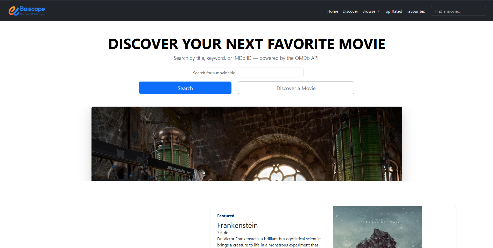
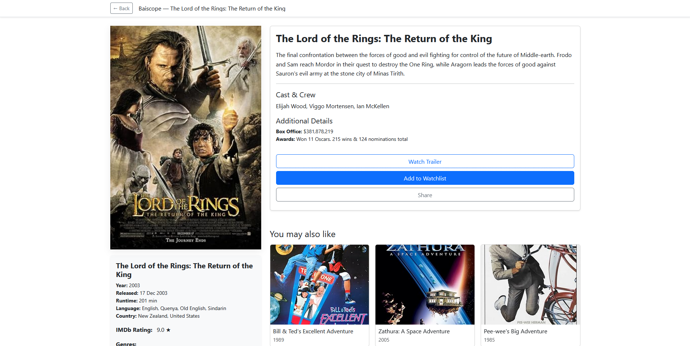
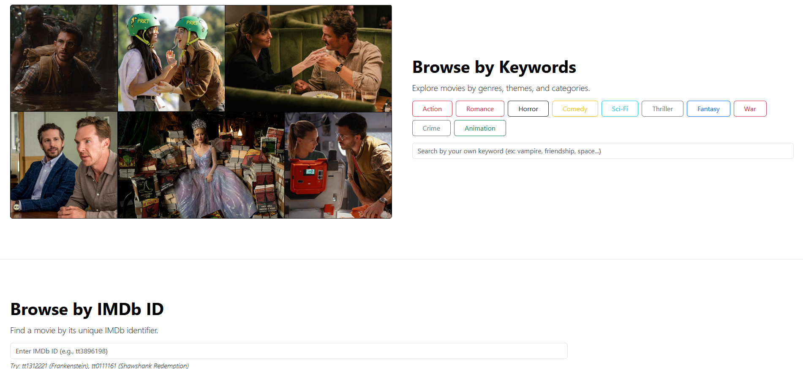

# Baiscope


[](https://github.com/wadiyage/baiscope/actions)
[](LICENSE)
[](https://developer.mozilla.org/)

Baiscope is a responsive movie discovery web application built with HTML, CSS, JavaScript, Bootstrap, and the OMDb API. It allows users to search for movies by title, discover random films, browse by keywords or IMDb ID, view detailed movie information, and manage a personal favourites list. The app features a clean, accessible UI optimized for both desktop and mobile devices.

## Quick Links

- **[Live Preview](https://baiscope.pages.dev)** - Deployed version of the app
- **[YouTube Demo](https://youtu.be/9VPCZwnCpBw)** - Watch a demo video
  [](https://youtu.be/9VPCZwnCpBw)
- **[Source Code](https://github.com/wadiyage/baiscope)** - GitHub repository

## Features

- **Movie Search by Title**: Search for movies using their title and get results with posters, release year, and brief information
- **Random Movie Discovery**: Generate a random movie suggestion to spark new discoveries
- **Browse by Keyword**: Explore movies using keywords or predefined tags
- **Browse by IMDb ID**: Directly access movie details using IMDb identifiers
- **Movie Detail Page**: Comprehensive movie information including plot, cast, ratings, and posters
- **Favourites System**: Save favorite movies locally and manage them in a dedicated section
- **Top Rated/Popular Movies**: Browse curated lists of highly-rated and popular films
- **Responsive Design**: Fully responsive layout that works seamlessly across devices

## Screenshots

> Placeholder screenshots - replace with actual images

-  - Main search and discovery interface 
-  - Detailed movie information page
-  - Quick walkthrough of the app functionality

## Installation

### Option 1: Open Locally (Quick Start)
1. Clone the repository:
   ```bash
   git clone https://github.com/wadiyage/baiscope.git
   cd baiscope
   ```
2. Open `index.html` directly in your web browser by double-clicking the file or using your browser's "Open File" option.

### Option 2: Run with HTTP Server (Recommended)
For full functionality and to avoid CORS issues with the OMDb API:

1. Clone the repository:
   ```bash
   git clone https://github.com/wadiyage/baiscope.git
   cd baiscope
   ```

2. Start a local HTTP server:
   - **Using Python 3:**
     ```bash
     python -m http.server 8000
     ```
     Then open http://localhost:8000 in your browser.

   - **Using Node.js (serve package):**
     ```bash
     npm install -g serve
     serve -s . -l 8000
     ```
     Then open http://localhost:8000 in your browser.

## Usage

1. **Search for Movies**: Enter a movie title in the search box on the home page and press Enter or click the search button.

2. **Discover Random Movies**: Click the "Discover a Movie" button to load a randomly selected film.

3. **Browse by Keywords**: Use the keyword search or click on suggested tags to filter movies by specific terms.

4. **Search by IMDb ID**: Enter an IMDb ID (e.g., `tt0111161`) in the dedicated field to view specific movie details.

5. **View Movie Details**: Click on any movie card or poster to open the detailed information page.

6. **Manage Favourites**: On a movie's detail page, click the favourites icon to save it. Access your saved movies from the favourites section.

## Folder Structure

```
baiscope/
├── index.html              # Main home page
├── movie-details.html      # Movie details page
├── favourites.html         # Favourites management page
├── about.html              # About page
├── contact.html            # Contact page
├── privacy.html            # Privacy policy page
├── assets/
│   ├── css/
│   │   ├── style.css       # Main stylesheet
│   │   ├── movie.css       # Movie-specific styles
│   │   ├── movie-details.css # Details page styles
│   │   ├── responsive.css  # Responsive design styles
│   │   └── fonts.css       # Font definitions
│   ├── js/
│   │   ├── main.js         # Main application logic
│   │   ├── api.js          # OMDb API integration
│   │   ├── movie-details.js # Details page functionality
│   │   ├── favourite.js    # Favourites management
│   │   ├── ui.js           # UI utilities
│   │   ├── utils.js        # General utilities
│   │   └── jquery-3.7.1.min.js # jQuery library
│   ├── bootstrap/
│   │   ├── css/
│   │   │   └── bootstrap.min.css
│   │   └── js/
│   │       ├── bootstrap.bundle.min.js
│   │       └── bootstrap.min.js
│   ├── data/
│   │   └── topRated.json   # Sample movie data
│   └── images/
│       └── icons/          # Icon assets
├── fonts/                  # Custom fonts
├── owl-carousel/           # Carousel plugin
│   ├── owl.carousel.min.css
│   ├── owl.carousel.min.js
│   └── owl.theme.default.min.css
└── README.md               # This file
```

## Contributing

We welcome contributions to Baiscope! Here's how you can help:

1. Fork the repository on GitHub
2. Create a feature branch: `git checkout -b feature/your-feature-name`
3. Make your changes and commit them: `git commit -m 'Add some feature'`
4. Push to the branch: `git push origin feature/your-feature-name`
5. Open a Pull Request describing your changes

Please ensure your code follows the existing style and includes appropriate documentation. For major changes, please open an issue first to discuss the proposed changes.

## License

This project is licensed under the MIT License - see the [LICENSE](LICENSE) file for details.

## Author & Contact

**Author:** wadiyage  
**Email:** wadiyage567@example.com  
**GitHub:** [wadiyage](https://github.com/wadiyage)  

For questions, bug reports, or feature requests, please open an issue on the [GitHub repository](https://github.com/wadiyage/baiscope/issues).

## Acknowledgements

- [OMDb API](http://www.omdbapi.com/) - Movie database API
- [Bootstrap](https://getbootstrap.com/) - CSS framework
- [Owl Carousel](https://owlcarousel2.github.io/OwlCarousel2/) - Carousel plugin
- [jQuery](https://jquery.com/) - JavaScript library

## Future Improvements & Roadmap

- [ ] Implement user authentication and cloud-based favourites storage
- [ ] Add movie recommendations based on viewing history
- [ ] Integrate with additional movie databases (TMDb, etc.)
- [ ] Add offline support with service workers
- [ ] Implement advanced filtering and sorting options
- [ ] Add movie trailer integration
- [ ] Create a mobile app version using React Native
- [ ] Implement automated testing and CI/CD pipeline
- [ ] Add internationalization support for multiple languages

